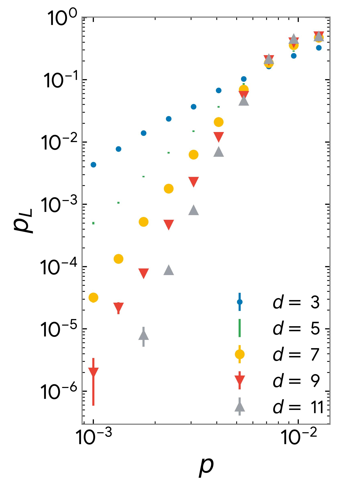

## Requirement

The main requirements are 

```
pip install stim==1.15.0
pip install sinter==1.14.0
pip install pymatching==2.3.1
```


The other requirements are more basic such as `joblib`, `numpy`, etc.

## Repository Structure

```
.
├── data/
│   └── .txt # contains data files 
├── figs/
│   └── .jpeg # contains plots 
├── utils.py # has basis imports
├── gates.py # contains gate function based on stim
├── sc-memory.ipynb # simulation for generic circuit noise
├── sc-class 0.ipynb # simulation for class 0 noise model
├── sc-class 1.ipynb # simulation for class 1 noise model
├── sc-class 2.ipynb # simulation for class 2 noise model
└── README.md
```

## Usage 

Logical error rate of the surface code is calculated for the various noise model

- `sc-memory.ipynb` generic circuit level noise i.e. reset error, readout error, single qubit depolarizing noise after single qubit gate, idle and two qubit depolarizing noise after two qubit gate.
- `sc-class 0.ipynb` In arXiv:1208.0928, the class 0 errors are defined as errors that occur on the data qubits primarily data qubits identity operations are replaced by erroneous X, Y or Z operations
- `sc-class 1.ipynb` Class 1 is defined as errors that occur on the measure qubits, namely initialization, measurement and Hadamard operations
- `sc-class 2.ipynb` Class 2 is defined as errors in the measure qubit, data qubit CNOT operations


